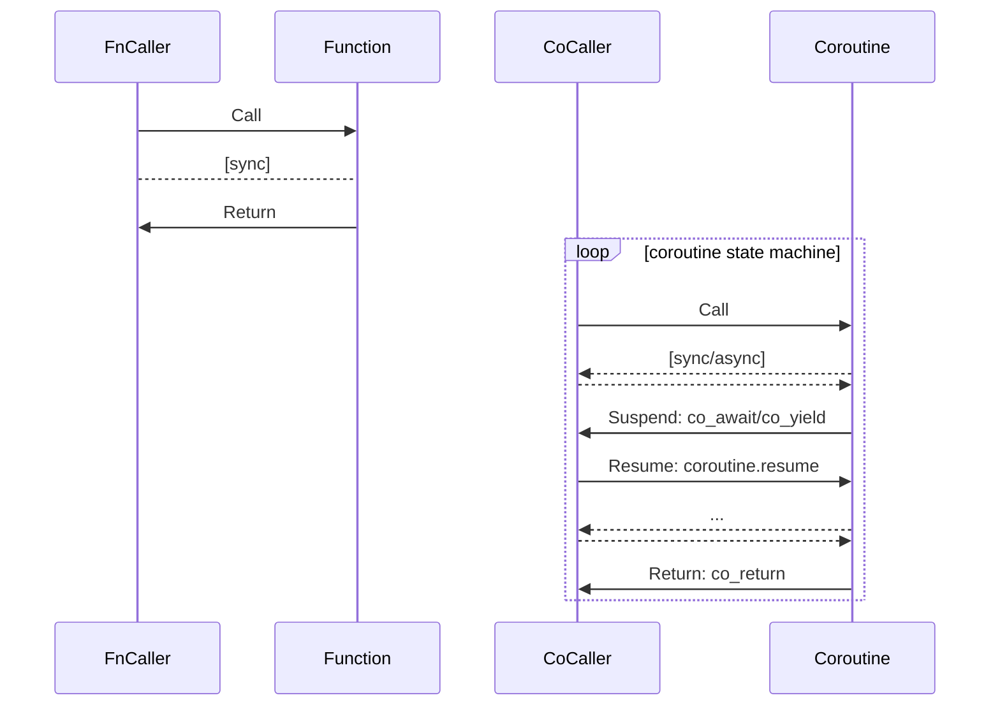

# C++20 Coroutines
## Reference
A series of C++ Coroutines articles written by Lewiss Baker at [here](https://lewissbaker.github.io/).
## Function vs Coroutine

## co_return
```llvm
define i64 @_ZN12CoroutineRef8coreturnEv()
define void @__await_suspend_wrapper__ZN12CoroutineRef8coreturnEv_init(ptr %0, ptr %1)
define void @__await_suspend_wrapper__ZN12CoroutineRef8coreturnEv_final(ptr %0, ptr %1)
define i32 @main()
define void @_ZN12CoroutineRef8coreturnEv.resume(ptr %0)
define void @_ZN12CoroutineRef8coreturnEv.destroy(ptr %0)
define void @_ZN12CoroutineRef8coreturnEv.cleanup(ptr %0)
```
```
FILE          LINE    SYMBOL
F: cotask     L: 11   S: promise_type
F: cotask     L: 16   S: get_return_object
F: cotask     L: 21   S: initial_suspend
F: coreturn   L: 8    S: coreturn
F: cotask     L: 30   S: return_void
F: cotask     L: 26   S: final_suspend
F: cotask     L: 13   S: ~promise_type
```
## co_await
```llvm
define i64 @_ZN12CoroutineRef7coawaitEv()
define void @__await_suspend_wrapper__ZN12CoroutineRef7coawaitEv_init(ptr %0, ptr %1)
define void @__await_suspend_wrapper__ZN12CoroutineRef7coawaitEv_await(ptr %0, ptr %1)
define void @__await_suspend_wrapper__ZN12CoroutineRef7coawaitEv_final(ptr %0, ptr %1)
define i32 @main()
define void @_ZN12CoroutineRef7coawaitEv.resume(ptr %0)
define void @_ZN12CoroutineRef7coawaitEv.destroy(ptr %0)
define void @_ZN12CoroutineRef7coawaitEv.cleanup(ptr %0)
```
### sync
```
FILE          LINE    SYMBOL
F: cotask     L: 11   S: promise_type
F: cotask     L: 16   S: get_return_object
F: cotask     L: 21   S: initial_suspend
F: coawait    L: 9    S: coawait
F: cowaiter   L: 11   S: await_ready
F: cowaiter   L: 17   S: await_resume
F: cotask     L: 30   S: return_void
F: cotask     L: 26   S: final_suspend
F: cotask     L: 13   S: ~promise_type
```
### async
```
FILE          LINE    SYMBOL
F: cotask     L: 55   S: promise_type
F: cotask     L: 60   S: get_return_object
F: cotask     L: 65   S: initial_suspend
F: coawait    L: 24   S: main
F: coawait    L: 9    S: coawait_async
F: cowaiter   L: 22   S: awaiter_async
F: coawait    L: 12   S: coawait_async
F: cowaiter   L: 28   S: await_ready
F: cowaiter   L: 37   S: await_suspend
F: coawait    L: 24   S: main
F: cowaiter   L: 42   S: await_resume
F: coawait    L: 12   S: coawait_async
F: cowaiter   L: 28   S: await_ready
F: cowaiter   L: 37   S: await_suspend
F: coawait    L: 24   S: main
F: cowaiter   L: 42   S: await_resume
F: coawait    L: 12   S: coawait_async
F: cowaiter   L: 28   S: await_ready
F: cowaiter   L: 37   S: await_suspend
F: coawait    L: 24   S: main
F: cowaiter   L: 42   S: await_resume
F: coawait    L: 15   S: coawait_async
F: cowaiter   L: 25   S: ~awaiter_async
F: cotask     L: 74   S: return_void
F: cotask     L: 70   S: final_suspend
F: coawait    L: 27   S: main
F: cotask     L: 50   S: ~task_async
F: cotask     L: 57   S: ~promise_type
```
## co_yield
```llvm
define i64 @_ZN12CoroutineRef7coyieldEv()
define void @__await_suspend_wrapper__ZN12CoroutineRef7coyieldEv_init(ptr %0, ptr %1)
define void @__await_suspend_wrapper__ZN12CoroutineRef7coyieldEv_yield(ptr %0, ptr %1)
define void @__await_suspend_wrapper__ZN12CoroutineRef7coyieldEv_final(ptr %0, ptr %1)
define i32 @main()
define void @_ZN12CoroutineRef7coyieldEv.resume(ptr %0)
define void @_ZN12CoroutineRef7coyieldEv.destroy(ptr %0)
define void @_ZN12CoroutineRef7coyieldEv.cleanup(ptr %0)
```
### sync
```
FILE          LINE    SYMBOL
F: cotask     L: 11   S: promise_type
F: cotask     L: 16   S: get_return_object
F: cotask     L: 21   S: initial_suspend
F: coyield    L: 8    S: coyield
F: cotask     L: 35   S: yield_value
F: cotask     L: 30   S: return_void
F: cotask     L: 26   S: final_suspend
F: cotask     L: 13   S: ~promise_type
```
### async
```
FILE          LINE    SYMBOL
F: cotask     L: 111  S: promise_type
F: cotask     L: 116  S: get_return_object
F: cotask     L: 123  S: initial_suspend
F: coyield    L: 23   S: main
F: coyield    L: 8    S: coyield_async
F: cotask     L: 137  S: yield_value
F: cotask     L: 91   S: awaiter_async
F: cotask     L: 94   S: await_ready
F: cotask     L: 103  S: await_suspend
F: coyield    L: 23   S: main
F: cotask     L: 107  S: await_resume
F: cotask     L: 92   S: ~awaiter_async
F: coyield    L: 10   S: coyield_async
F: cotask     L: 137  S: yield_value
F: cotask     L: 91   S: awaiter_async
F: cotask     L: 94   S: await_ready
F: cotask     L: 103  S: await_suspend
F: coyield    L: 23   S: main
F: cotask     L: 107  S: await_resume
F: cotask     L: 92   S: ~awaiter_async
F: coyield    L: 12   S: coyield_async
F: cotask     L: 137  S: yield_value
F: cotask     L: 91   S: awaiter_async
F: cotask     L: 94   S: await_ready
F: cotask     L: 100  S: await_suspend
F: cotask     L: 107  S: await_resume
F: cotask     L: 92   S: ~awaiter_async
F: coyield    L: 14   S: coyield_async
F: cotask     L: 132  S: return_void
F: cotask     L: 128  S: final_suspend
OK.
F: cotask     L: 85   S: ~task_yield_async
F: cotask     L: 113  S: ~promise_type
```
